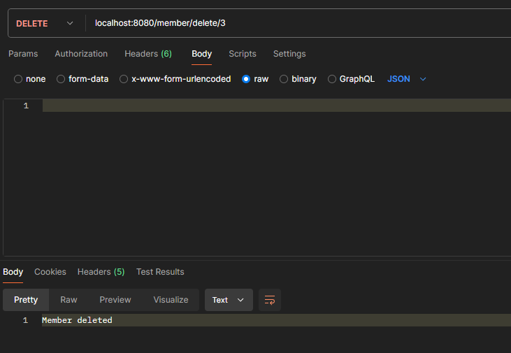

# Тестування працездатності системи

Для перевірки працездатності використовується застосунок Postman.

Перевірятись будуть таблиці **role**, **user** та **member**

## Role

### POST

### GET (all)

### GET (id)

### PUT

### DELETE

## User

### POST

### GET (all)

### GET (id)

### PUT

### DELETE

## Member

### POST

### GET (all)

### GET (id)

### GET (roleID)

### PUT

### DELETE

